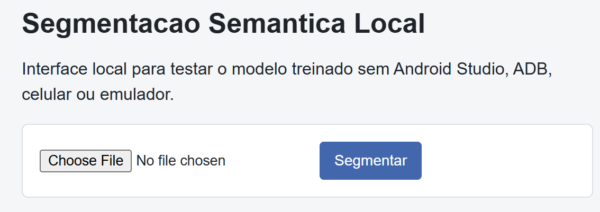
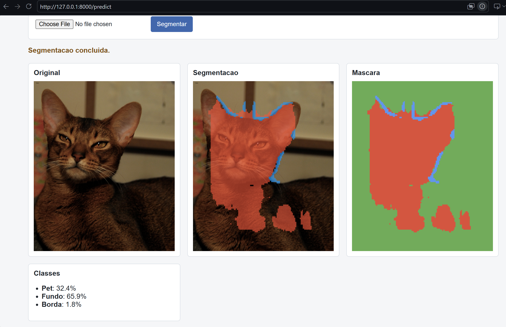

# App Segmentation

Consolidated implementation of the semantic segmentation activity.

This folder is an independent task delivery:

- `training`: Python/Jupyter Notebook model and TFLite export script.
- `android_app`: Java Android app with TensorFlow Lite for prediction and mask overlay.
- `local_web_app`: localhost interface for testing segmentation without ADB/device.
- `docs`: mobile and localhost testing guides.

## Task Objective

Train a semantic segmentation model on Oxford-IIIT Pet, evaluate basic metrics, and deploy the model in an Android app. The expected final deliverable is a screenshot of the app running with the segmented mask overlaid on the image and the repository link.

## Structure

```text
app_segmentation/
  README.md
  docs/
    mobile_app_test.md
    localhost_test.md
  training/
    segmentation-practice-2025-1.ipynb
    export_tflite.py
    requirements.txt
    requirements-export.txt
    README-training.md
  android_app/
    build.gradle
    settings.gradle
    gradlew
    gradlew.bat
    app/
      src/main/assets/README.md
      src/main/assets/model.tflite  # generated by training/export_tflite.py
      src/main/java/com/andre/tflite/segmentation/MainActivity.java
      src/main/java/com/andre/tflite/segmentation/Segmenter.java
      src/main/java/com/andre/tflite/segmentation/SegmentationResult.java
  local_web_app/
    server.py
    requirements.txt
    README.md
```

The Android test directories were removed from this consolidated version, as requested.

## Pipeline

The notebook uses the Oxford-IIIT Pet dataset with three classes:

```text
0 = Pet
1 = Background
2 = Border
```

The original dataset masks are 1-indexed; during training, they are converted to 0-indexed labels:

```text
target = mask_original - 1
```

The main model is a simple U-Net:

```text
f_theta: R^(1 x 3 x 128 x 128) -> R^(1 x 3 x 128 x 128)
```

In the Android app, the final mask is computed per pixel:

```text
class(y, x) = argmax_c logits(c, y, x)
```

The app preprocessing replicates the notebook:

```text
x_norm = (x_rgb / 255 - mean) / std
mean = [0.485, 0.456, 0.406]
std  = [0.229, 0.224, 0.225]
```

## Step-by-Step

This section describes the complete recommended flow for testing segmentation on `localhost`, without Android Studio, without a phone, without an emulator, and without ADB.

### 1. Open the Project Folder

In PowerShell:

```powershell
cd app_segmentation
```

### 2. Prepare the Python Environment

Use the same Python environment where the notebook was executed. If you are creating a new environment:

```powershell
python -m venv .venv
.\.venv\Scripts\activate
```

Install the training and local interface dependencies:

```powershell
pip install torch torchvision --index-url https://download.pytorch.org/whl/cu118
pip install -r training\requirements.txt
pip install -r local_web_app\requirements.txt
```

If you are using Colab or another Linux environment, use equivalent paths.

### 3. Train or Confirm the Model

Run the notebook:

```text
training/segmentation-practice-2025-1.ipynb
```

The notebook covers:

- loading the Oxford-IIIT Pet dataset;
- U-Net training;
- optional FCN-ResNet50 training;
- IoU and accuracy;
- prediction visualization.

At the end, confirm that the following file exists:

```text
training/SimpleUNet_best.pth
```

This file is the weight used by the `localhost` server.

### 4. Start the Localhost Server

From the project root folder:

```powershell
python local_web_app\server.py
```

If you want to use another weight file:

```powershell
python local_web_app\server.py --weights path\to\SimpleUNet_best.pth
```

When it is running, the terminal should show:

```text
Server running at http://127.0.0.1:8000
```

### 5. Open the Interface in the Browser

Open:

```text
http://localhost:8000
```

### 6. Send an Image for Segmentation



On the page:

1. Click `Choose File`.
2. Select a common image file, such as `.jpg`, `.jpeg`, `.png`, or `.webp`.
3. Prefer a cat or dog photo, because the training uses Oxford-IIIT Pet.
4. Do not select `SimpleUNet_best.pth`, `model.tflite`, `.ipynb`, PDF, or source-code files.
5. Click `Segmentar`.

### 7. Check the Result

The page should display:

- `Original`: uploaded image;
- `Segmentacao`: original image with the colored mask overlaid;
- `Mascara`: isolated segmented mask;
- `Classes`: percentages for `Pet`, `Background`, and `Border`.

This flow tests the model and the visual prediction on `localhost`. It does not test the Android APK.

Detailed guide:

```text
docs/localhost_test.md
```

## Output Example

The image below shows the expected result when running the local interface at `http://localhost:8000` and submitting a test image:



The expected output contains:

- original image;
- image with the mask overlaid;
- isolated segmented mask;
- percentages for the `Pet`, `Background`, and `Border` classes.

## Optional Android Test

To test the Java Android APK, first generate the TFLite model:

```powershell
cd training
pip install -r requirements-export.txt
python export_tflite.py
```

By default, the script writes the model to:

```text
android_app/app/src/main/assets/model.tflite
```

Then open the project:

```text
android_app
```

Android build prerequisite: use JDK 17 or JDK 21. JDK `26.0.1` may fail in Gradle before compilation.

The detailed mobile testing guide is available at:

```text
docs/mobile_app_test.md
```

## Android Model Contract

The app expects an FP32 model at:

```text
android_app/app/src/main/assets/model.tflite
```

Supported formats:

```text
Input:  [1, H, W, 3] or [1, 3, H, W]
Output: [1, H, W, C], [1, C, H, W] or [1, H, W]
```

The consolidated delivery removes the old classification `.tflite` files. Generate the model with `training/export_tflite.py` before taking the final screenshot.

## Notes

- PyTorch to TFLite conversion uses `litert_torch`; Colab/Linux is the recommended environment for this step.
- The consolidated app uses the package `com.andre.tflite.segmentation`.
- The app code is written in Java; the model and the training/export flow are written in Python.
- This delivery does not add unit tests.

## References

- [Aandre99/Tflite-Android-Classification](https://github.com/Aandre99/Tflite-Android-Classification)
- [hglps/semantic-segmentation-dl251](https://github.com/hglps/semantic-segmentation-dl251)
